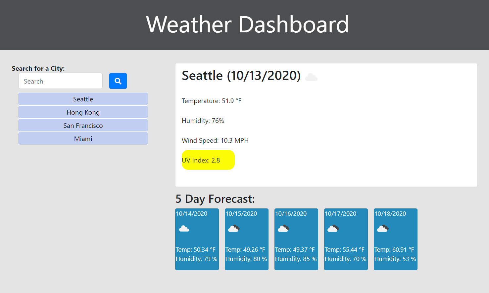
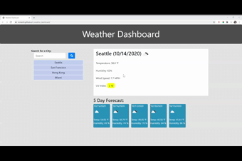

# Weather Dashboard

Keep track of the weather forecast using this Weather Dashboard!

## Table of Contents

1. [Usage](#Usage)
1. [Languages and Concepts](#Languages-and-Concepts)
1. [Method](#Method)
1. [Demo](#Demo)
1. [Roadmap](#Roadmap)
1. [Links](#Links)
1. [Contributing](#Contributing)
1. [License](#License)

## Usage

You can use this weather dashboard to find out the current weather along with the 5 day forecast of your favorite cities! And your searches are saved allowing you to keep track throughout the year.

## Languages and Concepts
- HTML
- CSS
- JavaScript
- jQuery
- OpenWeatherMap API
- localStorage

## Method

To begin this project, I reviewed what the user was wanting to access with this website. Then I decided what was needed to get started and work my way through each step of development.

1. First I established my HTML, JavaScript and CSS pages, added links to Bootstrap and jQuery and the links to connect the pages. Then I started the development process by creating my base layer on the HTML page, by creating the jumbotron and getting the grid established with rows and columns. I then added in the search field form and a card to hold the main content.

1. Next I added code to the main tag with the card class to hold the current city when retrieved. I added \
's with class names to hold of the needed search results: city, temperature, humidity, wind and UV index. Then I created the initial .ajax() call to the OpenWeatherMap API and set it to the text of the main card.

1. Looking over my code so far, I decide that instead of having everything within the .on("click") function, I should create separate functions to hold my .ajax() calls and then I can call those functions within the click handler. This would give the function more versatility and make it easier to call if needed in other click handlers. So I separated my .ajax() call and set the texts and created \
's of the searched city names. Then I started on the click handler for when a city name is entered and the search button is clicked, then putting the name into the \
 in the city tiles.

1. Next I wanted to start to refine my information that I just received to establish more of my main card. I added in the current date to the main card using moment.js. Then I converted the wind speed into MPH and added some styling.

1. Then I moved down to creating the 5 day forecast and began the initial .ajax() call. I added height to the main card so it was fixed and then added styling to the forecast class to create cards. I added the heading and assigned id's for the forecast. Then to add in the information, I made a for loop to make 5 boxes with the date (using moment.js), icon, temperature and humidity received from the API call.

1. Next I worked on getting more of the framework established and the correct information showing. I adjusted the spacing of the forecast, removed the card class for the main weather display from the HTML so it would appear when information is populated. Then I changed the city tiles into buttons and converted the temperature from Kelvin into Fahrenheit. Then I established the localStorage. I created an array to hold the cities as they are searched and added an id of the city name to the respective city tile.

1. Next to give the city tiles functionality, I added a click handler to the city tile buttons to run the functions again based off the buttons id. And I added an if statement to pull from localStorage and create new buttons on the city tile column so the information persists.

1. Then in order to keep the last search results populated on the page, I created a new localStorage item to hold the most recent searched city and to display that city's weather upon refresh.

1. The next piece of information I needed to populate is the UV Index which is found under a different API call. I added a function to find the UV index of the user input by using that initial call to find the latitude and longitude of the input city and putting that information into a new API call. I then set this information to display on the main card.

1. Now that the basic functionality was there, I added the weather icons to the current weather and forecast card by using another API call. I then adjusted the size of the icons for the forecast in the CSS file because they came out squished.

1. The next step was to color code the UV Index depending on the rating. I added an if else statement to determine the level of UV Index and to add the associated class (which would change the background color and font color if needed). I added the degree symbol to the temperature and made more styling adjustments to the city tile buttons and the jumbotron.

1. Now that my page was working, I deployed it on GitHub pages and found I was getting an error that, in short, it was making an insecure XML request. After some research, I found that the API call was set to http and it needed to be https. After making that adjustment, *that* error went away.

1. Then I added a span to the UV Index to make the background color apply to just the numbers intead of the whole line. Now on the deployed page, I was getting a new error. Again saying that it was making an insecure request, this time regarding the icons. After inspecting the code, I found that the icon API call was also set to http. So I changed it to https and the error cleared! Now it's ready.

## Demo

## Roadmap

To further this project, I would like to add a delete button to each city so the user can edit their selections. I would also like to create an error code if the user enters in a city that cannot be found with this API or it isn't a city. To advance it beyond that, I would like to add a different API so users can better specifiy the location by also using the state and/or country or by using the zip code and incorporating an overview map of the area's weather.

## Links

- [Weather Dashboard](https://ncmarsh.github.io/6_weather_dashboard/)
- [Project Repository](https://github.com/ncmarsh/6_weather_dashboard)
- [OpenWeatherMap API](https://openweathermap.org/guide)

### Contributing

This is a personal project; no contributions are required at this time.

### License

No license granted.

##### [Return to Top of Page](#Day-Planner)